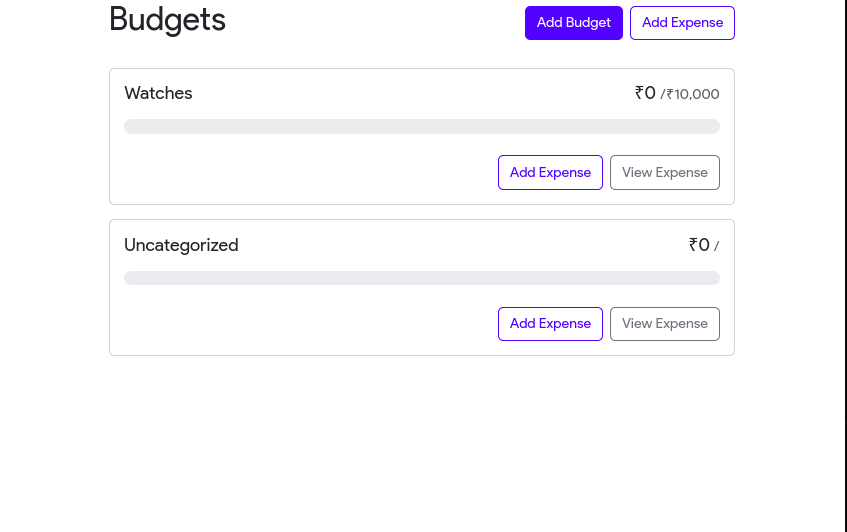
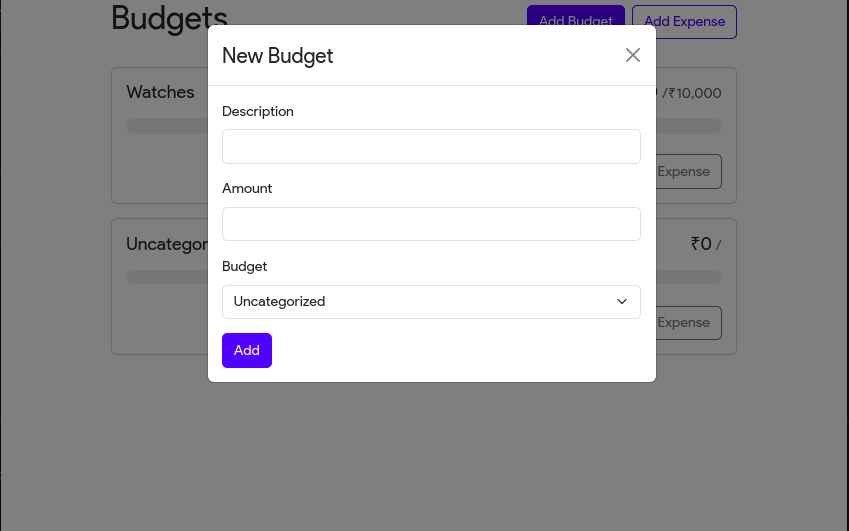
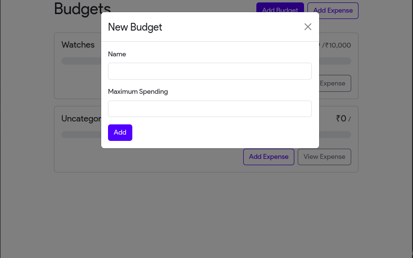
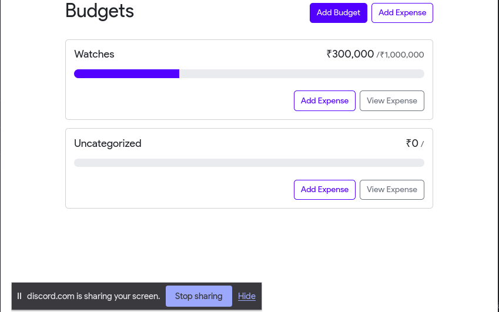
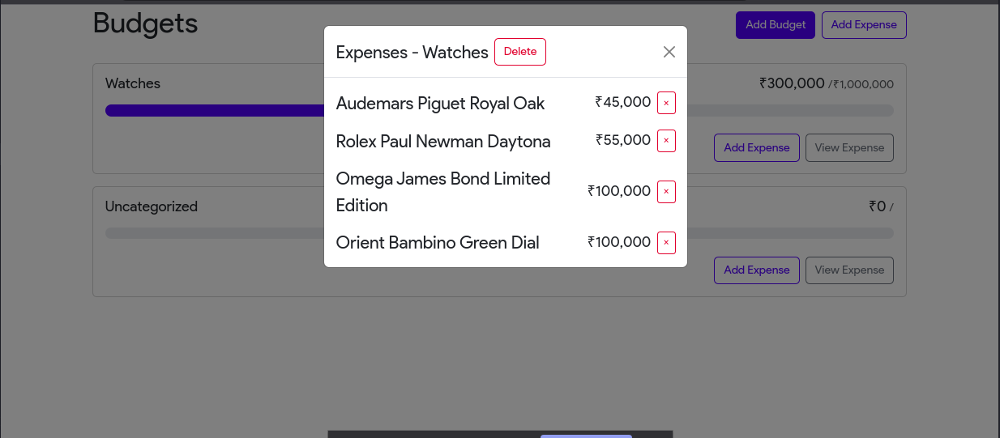

# Expense Tracker

- This is a expense tracker system built using simple-react.<br>
- This is the simple no-backend project built for my learning purpose.<br>
- One can easily install and use this project
- One can use the code freely there is no kind of copyright or restriction in the repository
- Contributors are eagerly invited to the issue section
- Step by step installation guide is provided below
- For any query email me at hetekta2709@gmail.com or sintheteisnotvalid@gmail.com

---

## Screenshots












---

## Installation Guide
1. First of all I spend more than 3 weeks coding this thing so please star this repository so that I can impress my crush 😁 

2. Clone the repository by the following command 
  ```
  git clone https://github.com/Hetosk1/expense-tracker
  ```

3. Navigate into directory & Install the depencies by the command 
  ```
  cd expense-tracker
  npm install
  ```

4. Start the Application
  ```
  npm start
  ```

---

### please do drop a star 
# Thankyou for reading till here 


